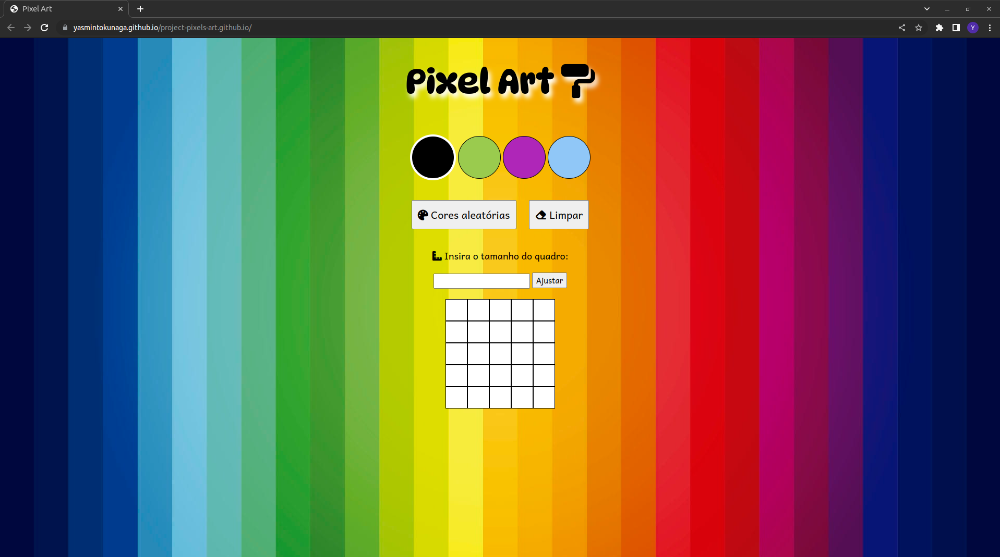

# Projeto Pixels Art 🎨 🧑‍🎨

Projeto realizado durante o curso de Desenvolvimento Web na Trybe em Dezembro, 2022.

# Conhecimentos técnicos utilizados: 

* HTML, 
* CSS, 
* JavaScript (DOM, seletores, eventos, Local Storage).

# Objetivo: 

Construir um quadro de pixels de tamanho ajustável para que o usuário possa colorir utilizando uma paleta de cores.

# Requisitos:

* Paleta de cores geradas de forma aleatória,
* Botão para atualizar a paleta
* Opção do usuário selecionar a cor e pintar o pixel ao clicar com o mouse
* Incluir um input para alterar o tamanho do quadro
* Salvar cores, tamanho do quadro e desenho feito pelo usuário no local storage.

# Resultado:

